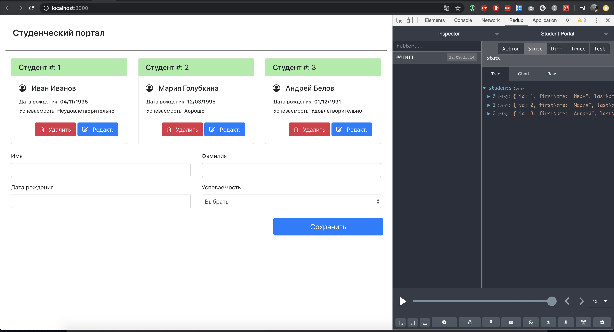
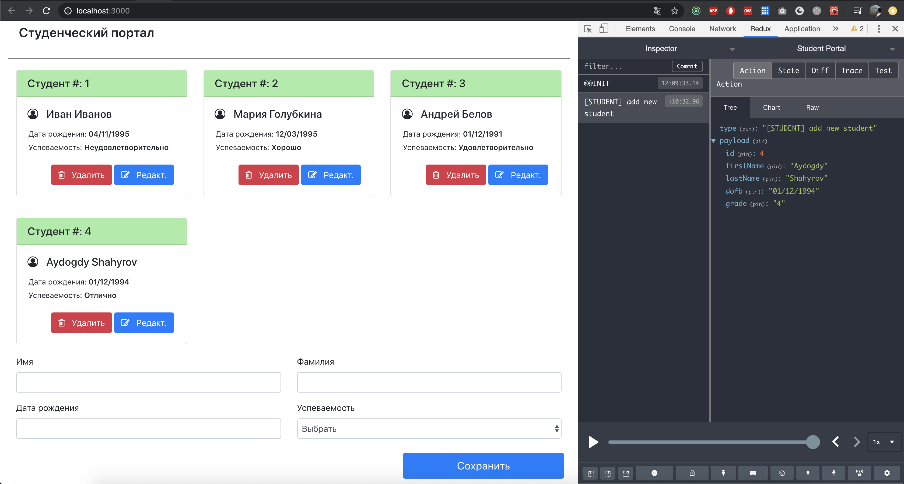
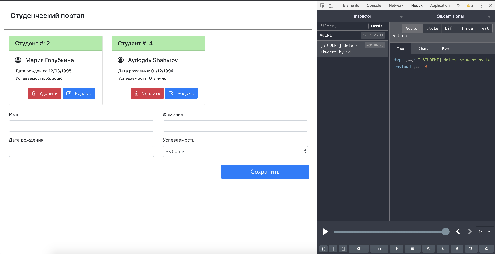
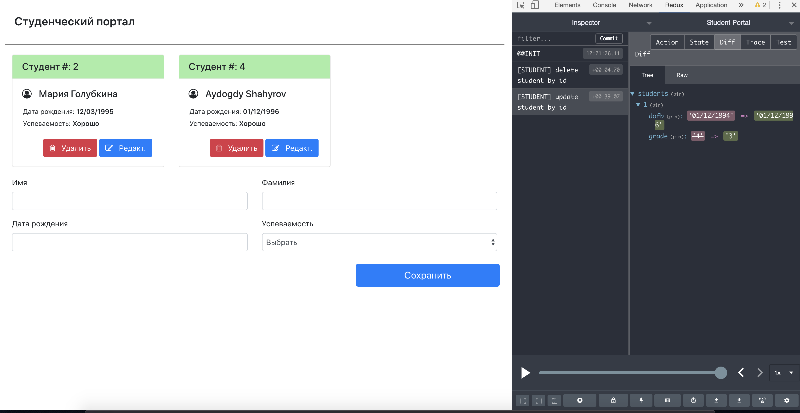

Student Portal - project was bootstrapped with [Create React App](https://github.com/facebook/create-react-app).

## Clone the repo

Clone the repo to run it locally.

## npm install

Once you got it locally, run:

### `npm install`

In the project directory, you can run:

### `npm start`

Screenshots:

Default State of the app (Init State)

Add Student action

Delete Student action

Edit Student action

